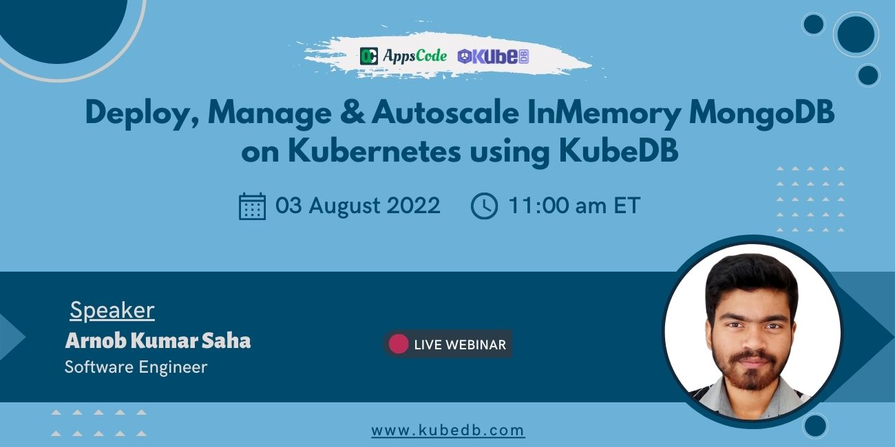

## AppsCode Webinar 03-08-22

<p class="has-text-centered">
  
</p>

## Deploy, Manage & Autoscale InMemory MongoDB on Kubernetes using KubeDB


### Install KubeDB
```shell
$ helm repo add appscode https://charts.appscode.com/stable/
$ helm repo update
$ helm install kubedb appscode/kubedb \
  --version v2022.08.05 \
  --namespace kubedb --create-namespace \
  --set kubedb-provisioner.enabled=true \
  --set kubedb-ops-manager.enabled=true \
  --set kubedb-autoscaler.enabled=true \
  --set kubedb-dashboard.enabled=true \
  --set kubedb-schema-manager.enabled=true \
  --set-file global.license=/path/to/the/license.txt
```

### Install cert-manager
```shell
$ helm repo add jetstack https://charts.jetstack.io
$ helm repo update

$ helm install \
  cert-manager jetstack/cert-manager \
  --namespace cert-manager \
  --create-namespace \
  --version v1.8.0 \
  --set installCRDs=true
```

### Generate ca.key and ca.crt
```shell
$ openssl req -x509 -nodes -days 365 -newkey rsa:2048 -keyout ./ca.key -out ./ca.crt -subj "/CN=mysql/O=kubedb"
```

### Create demo namespace
```shell
$ kubectl create ns demo
```

### Create secret with ca.crt and ca.key
```shell
$ kubectl create secret tls mongo-ca \
      --cert=ca.crt \
      --key=ca.key \
      --namespace=demo
```

### Deploy issuer
```shell
$ kubectl apply -f deploy/issuer.yaml
```

### Create config-secret (used in replicaset mongodb)
```shell
$ kubectl create secret generic -n db inmemory-config --from-file=./deploy/mongod.conf
OR
kubectl apply -f config-secret.yaml
```

### Deploy inMemory MongoDB replica set
```shell
$ kubectl apply -f deploy/db-replica.yaml
```

### Vertically scale the Pods
```shell
$ kubectl apply -f deploy/vertical.yaml
```


### Deploy Sharded MongoDB
```shell
$ kubectl apply -f deploy/db-shard.yaml
```

### Horizontally scale the Pods
```shell
$ kubectl apply -f deploy/horizontal.yaml
```

### Deploy replica set MongoDB if you had deleted it
```shell
$ kubectl apply -f deploy/db-replica.yaml
```

### Apply the MongoDBAutoscaler yaml
```shell
$ kubectl apply -f deploy/autoscaler.yaml
```


## Mongo specific commands 
```shell
# On TLS disabled MongoDB
$ mongo -u root -p "$MONGO_INITDB_ROOT_PASSWORD"

# On TLS enabled MongoDB
$ mongo --ipv6 --host localhost --tls --tlsCAFile /var/run/mongodb/tls/ca.crt --tlsCertificateKeyFile /var/run/mongodb/tls/mongo.pem -u root -p "$MONGO_INITDB_ROOT_PASSWORD"

# Insert data
$ db.products.insertOne({"hunny": "bunny"})

# To enable secondary for running commands into it
$ rs.slaveOk()

# Show the replica-set status
$ rs.status()

# To show db-specific configurations & arguments
$ db._adminCommand({getCmdLineOpts: 1})

# maximum limit of InMemory Storage
db.serverStatus().inMemory.cache["maximum bytes configured"]

# Currently used InMemory Storage
db.serverStatus().inMemory.cache["bytes currently in the cache"]
```