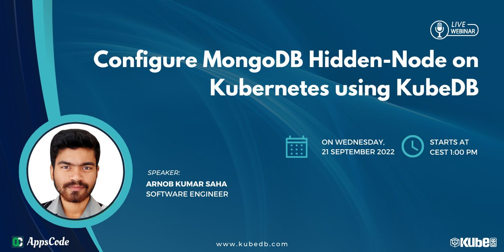

## AppsCode Webinar 21-09-22

<p class="has-text-centered">
  
</p>

## Configure MongoDB Hidden-Node on Kubernetes using KubeDB


### Install KubeDB
```shell
$ helm repo add appscode https://charts.appscode.com/stable/
$ helm repo update
$ helm install kubedb appscode/kubedb \
  --version v2022.08.08 \
  --namespace kubedb --create-namespace \
  --set kubedb-provisioner.enabled=true \
  --set kubedb-ops-manager.enabled=true \
  --set kubedb-autoscaler.enabled=true \
  --set kubedb-dashboard.enabled=true \
  --set kubedb-schema-manager.enabled=true \
  --set-file global.license=/path/to/the/license.txt
```

### Install cert-manager
```shell
$ helm repo add jetstack https://charts.jetstack.io
$ helm repo update

$ helm install \
  cert-manager jetstack/cert-manager \
  --namespace cert-manager \
  --create-namespace \
  --version v1.8.0 \
  --set installCRDs=true
```

### Generate ca.key and ca.crt
```shell
$ openssl req -x509 -nodes -days 365 -newkey rsa:2048 -keyout ./ca.key -out ./ca.crt -subj "/CN=mysql/O=kubedb"
```

### Create demo namespace
```shell
$ kubectl create ns demo
```

### Create secret with ca.crt and ca.key
```shell
$ kubectl create secret tls mongo-ca \
      --cert=ca.crt \
      --key=ca.key \
      --namespace=demo
```

### Deploy issuer
```shell
$ kubectl apply -f deploy/issuer.yaml
```

### Deploy MongoDB replica set
```shell
$ kubectl apply -f deploy/replica.yaml
```

### Vertically scale the Pods
```shell
$ kubectl apply -f deploy/ops/vertical.yaml
```

### Create config-secret (used in `Reconfigure` opsRequest)
```shell
$ kubectl create secret generic -n demo connection-conf --from-file=mongod.conf=./connection-conf
$ kubectl create secret generic -n demo log-conf --from-file=mongod.conf=./log-conf
```

### Reconfigure the Pods
```shell
$ kubectl apply -f deploy/ops/reconfigure.yaml
```

All the previous steps were performed on a `kind` cluster. But to apply the below sharded mongo cluster, We have used a `Linode` kubernetes cluster.
Because, kind's default storage class `standard` doesn't support volume-expansion. 
If you use some other cloud solution for this, all you need to change is the `storageClassName` in `deploy/shard-linode.yaml` file.

### Deploy Sharded MongoDB with hidden-node
```shell
$ kubectl apply -f deploy/shard-linode.yaml
```

### Expand the volumes
```shell
$ kubectl apply -f deploy/ops/expansion.yaml
```

### Horizontally scale the MongoDB sharded cluster
```shell
$ kubectl apply -f deploy/ops/horizontal.yaml
```

## Mongo specific commands
```shell
# On TLS disabled MongoDB
$ mongo -u root -p "$MONGO_INITDB_ROOT_PASSWORD"

# On TLS enabled MongoDB
$ mongo --ipv6 --host localhost --tls --tlsCAFile /var/run/mongodb/tls/ca.crt --tlsCertificateKeyFile /var/run/mongodb/tls/mongo.pem -u root -p "$MONGO_INITDB_ROOT_PASSWORD"

# On Arbiter pods
$ mongo admin

# To enable secondary for running commands into it
$ rs.slaveOk()

# Show the replica-set status
$ rs.status()

# Show the replica-set configurations (including if a pod is `hidden` or not)
$ rs.config()

# To show db-specific configurations & arguments
$ db._adminCommand({getCmdLineOpts: 1})
```