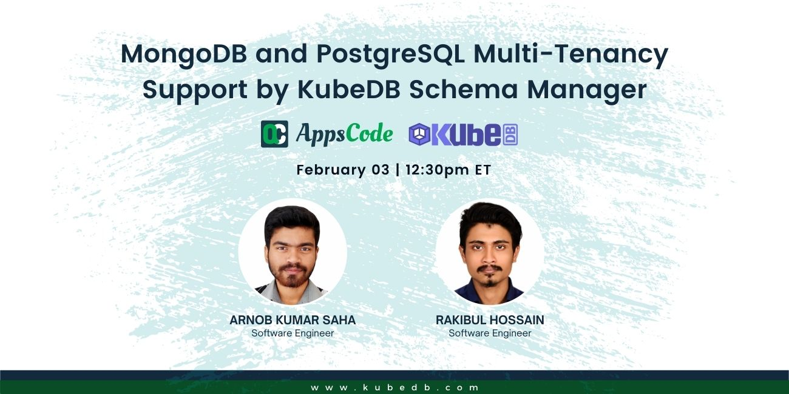

## AppsCode Webinar 01-06-22

<p class="has-text-centered">
  
</p>

## MongoDB & PostgreSQL Multi-Tenancy support by KubeDB Schema-manager


### Install KubeDB
```shell
$ helm repo add appscode https://charts.appscode.com/stable/
$ helm repo update
$ helm install kubedb appscode/kubedb \
  --version v2022.05.24 \
  --namespace kubedb --create-namespace \
  --set kubedb-provisioner.enabled=true \
  --set kubedb-ops-manager.enabled=true \
  --set kubedb-autoscaler.enabled=true \
  --set kubedb-dashboard.enabled=true \
  --set kubedb-schema-manager.enabled=true \
  --set-file global.license=/path/to/the/license.txt
```

### Install KubeVault
```shell
$ helm search repo appscode/kubevault
$ helm repo update
$ helm install kubevault appscode/kubevault \
    --version v2022.06.16 \
    --namespace kubevault --create-namespace \
    --set-file global.license=/home/arnob/files/license/kubevault.txt
```

### Install Stash
```shell
$ helm search repo appscode/stash
$ helm repo update
$ helm install stash appscode/stash             \
  --version v2022.05.18                  \
  --namespace kube-system                       \
  --set features.enterprise=true                \
  --set-file global.license=/home/arnob/files/license/stash.txt
```

### Install cert-manager
```shell
$ helm repo add jetstack https://charts.jetstack.io
$ helm repo update

$ helm install \
  cert-manager jetstack/cert-manager \
  --namespace cert-manager \
  --create-namespace \
  --version v1.8.0 \
  --set installCRDs=true
```

### Install Minio Server
```shell
$ helm repo add minio https://charts.min.io/
$ kubectl port-forward svc/minio-console -n minio 9001
helm install --namespace minio --create-namespace --values=deploy/minio/value.yaml minio minio/minio
```

### Generate ca.key and ca.crt
```shell
$ openssl req -x509 -nodes -days 365 -newkey rsa:2048 -keyout ./ca.key -out ./ca.crt -subj "/CN=mysql/O=kubedb"
```

### Create namespaces
```shell
$ kubectl create ns db
$ kubectl create ns demo
$ kubectl create ns dev

# Change directory
$ cd deploy
# As all the `kubectl apply` commands will be run from `deploy/` directory
```

# Mongo part

### Deploy MongoDB replicaSet
```shell
$ kubectl apply -f db/replica.yaml
```

### Deploy VaultServer
```shell
$ kubectl apply -f vault.yaml
```

### Apply a simple schema
```shell
$ kubectl apply -f simple-schema.yaml
```

## Initializing with script
```shell
# Create the configuration-script for initialization
$ kubectl apply -f init/configmap.yaml

# Apply schema for initialization
$ kubectl apply -f init/script.yaml
```
## Initializing with Snapshot
```shell
# Create the secret for minio server
$ kubectl apply -f stash/minio-secret.yaml

# Apply the repository yaml(where the db backup exists)
$ kubectl apply -f stash/repository.yaml

# Apply the schema for restore
$ kubectl apply -f stash/restore.yaml
```

## Work with Standalone MongoDB
```shell
# Create db3 namespace
$ kubectl create ns db3 

# Create standalone database
$ kubectl apply -f db/standalone.yaml

# Apply the schema 
$ kubectl apply -f alone-schema.yaml
```

## Work with Sharded MongoDB
```shell
# Create db2 namespace
$ kubectl create ns db2 

# Create standalone database
$ kubectl apply -f db/shard.yaml

# Apply the schema 
$ kubectl apply -f shard-schema.yaml
```

# Postgres part
### Deploy the postgres database
```shell
$ kubectl apply -f postgres/postgreSQL.yaml
```

### Deploy VaultServer
```shell
$ kubectl apply -f postgres/vaultServer.yaml
```

### Apply a simple schema
```shell
$ kubectl apply -f postgres/basic-schema.yaml
```

## Initializing with script
```shell
# Create the configuration-script for initialization
$ kubectl apply -f postgres/initconfig.yaml

# Apply schema for initialization
$ kubectl apply -f postgres/init-schema.yaml
```
## Initializing with Snapshot
```shell
# Create the secret for minio server
$ kubectl apply -f postgres/repo-secret.yaml

# Apply the repository yaml(where the db backup exists)
$ kubectl apply -f postgres/repository.yaml

# Apply the schema for restore
$ kubectl apply -f postgres/restore-schema.yaml
```
